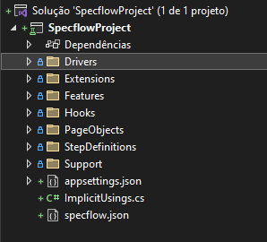

[](https://github.com/fpaganini/Core6-Specflow-Selenium-BootstrapProject/actions/workflows/dotnet.yml)

# Page Object Model
  

O modelo de Page Object é utilizado para separar os elementos que representam uma página a ser testada, aprimorando a organização e manutenção dos testes.

Para exemplo de uma página de login onde temos os três elementos:

```html
    <html>
        <input id="txtUsuario" name="userName" type="text" value="">
        <input id="txtSenha" name="userPassword" type="password" value="">
        <button id="btnLogar" type="submit">Logar</button>
    </html>
```

teremos o seguinte PageObject:

```c#
namespace project.PageObjects;

public class LoginPageObject
{
    private readonly IWebDriver _webDriver;

    public LoginPageObject(IWebDriver webDriver)
        => _webDirver = webDriver;

    public IWebElement TxtUsuario => _webDriver?.FindElement(By.Id("txtUsuario"));
    public IWebElement TxtSenha => _webDriver?.FindElement(By.Id("txtSenha"));
    public IWebElement BtnLogar => _webDriver?.FindElement(By.Id("btnLogar"));

}
```

## Cache na captura dos elementos

```c#

namespace project.PageObjects;

public class LoginPageObject
{
    private readonly IWebDriver _webDriver;
    private readonly Lazy<IWebElement> _txtUsuario;
    private readonly Lazy<IWebElement> _txtSenha;
    private readonly Lazy<IWebElement> _btnLogar;

    public LoginPageObject(IWebDriver webDriver)
    {
        _webDriver = webDriver;
        _txtUsuario = new Lazy<IWebElement>(() => _webDriver.FindElement(By.Id("txtUsuario")));
        _txtSenha = new Lazy<IWebElement>(() => _webDriver.FindElement(By.Id("txtSenha")));
        _btnLogar = new Lazy<IWebElement>(() => _webDriver.FindElement(By.Id("btnLogar")));
    }

    public IWebElement TxtUsuario => _txtUsuario.Value;
    public IWebElement TxtSenha => _txtSenha.Value;
    public IWebElement BtnLogar => _btnLogar.Value;
}

```

## Hierarquia de objetos

```html
    <html>
        <div class="grupoUsuario">
            <div class="usuario"></div>
        </div>
        <div class="usuario"></div>
    </html>
```

```c#

namespace project.PageObjects;

public class GrupoUsuarioPageObject
{
    private readonly IWebDriver _webDriver;

    public GrupoUsuarioPageObject(IWebDriver webDriver)
        => _webDirver = webDriver;

    public IWebElement DivGrupoUsuario => _webDriver.FindElement(By.ClassName("grupoUsuario"));
    public UsuarioPageObject UsuarioPageObject => new UsuarioPageObject(DivGrupoUsuario);
}

public class UsuarioPageObject
{
    private readonly IWebElement _webElement;

    public GrupoUsuarioPageObject(IWebElement webElement)
        => _webElement = webElement;

    public IWebElement DivUsuario => _webElement.FindElement(By.ClassName("usuario"));
}
```

## Benefícios do Page Object

- A responsabilidade do parser da página fica separada da lógica dos testes e da definição dos steps
- Quando ocorrer alguma mudança nas páginas, sem mudanças de processo, fica muito mais fácil a manutenção do teste por estas alterações estarem centralizadas nesta camada
- Os Bindings se tornam muito menos dependentes da estrutura do HTML


Mais informaçõpes:

[PageObjectModel - Specflow Official Docs](https://docs.specflow.org/projects/specflow/en/latest/Guides/PageObjectModel.html)


# Driver Pattern
  

O Driver Pattern é a criação de uma camada adicional entre as definições dos Steps e o código automatizado. Esta camada é uma boa prática para melhor organizar os Bindings e o Código de automatização.

## Benefícios do Driver Pattern

- Mais fácil de manter pois divide as responsabilidades
- Metodos ficam mais fáceis de reutilizar em diferentes definições e etapas, ou até mesmo combinar várias etapas em uma única.
- As definições das Steps ficam mais fáceis de ler, tornando muito mais acessível a leitura para pessoas que não são tecnicas, agiliza também a leitura para pessoas técnicas pois obtem de imediato o resumo dos passos realizados sem conter detalhes do desenvolvimento.
- Usa a injeção de contexto para conectar várias classes

*Antes*

  

*Depois*

  

Mais informações:

[Driver Pattern - Specflow Official Docs](https://docs.specflow.org/projects/specflow/en/latest/Guides/DriverPattern.html)

